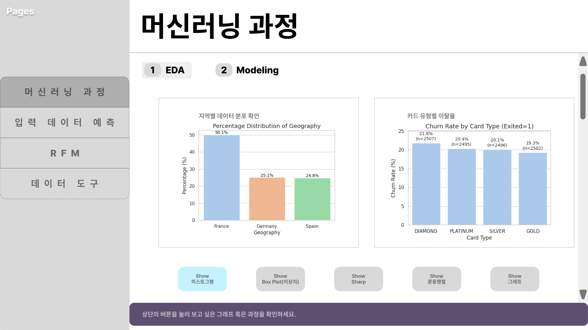
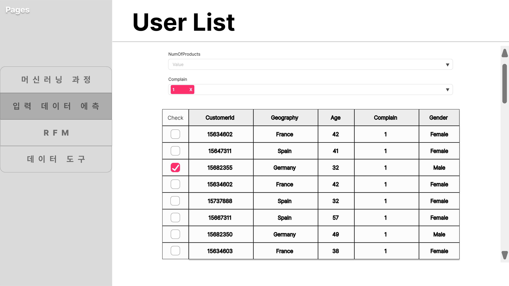
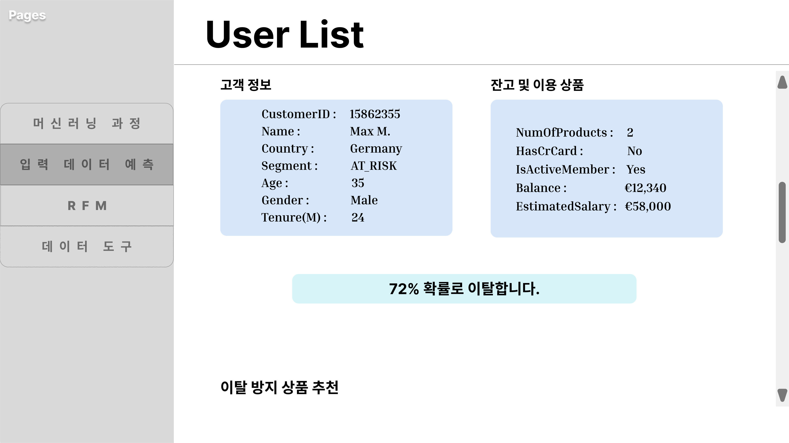
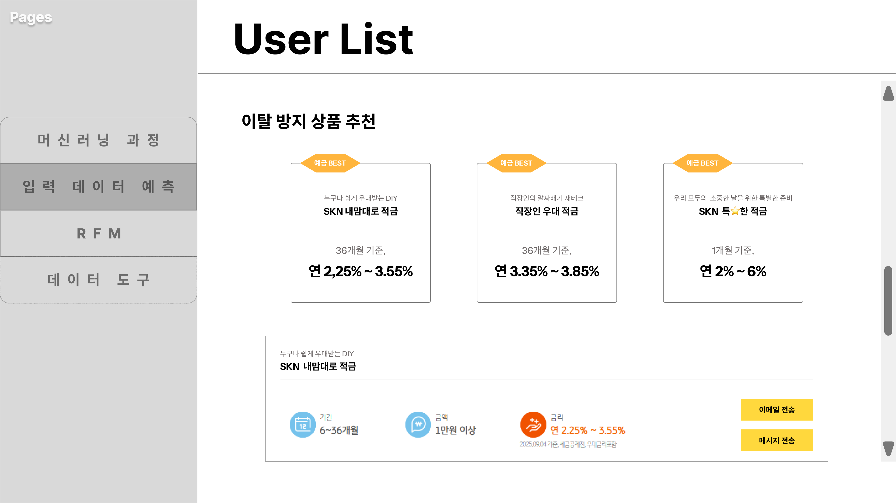
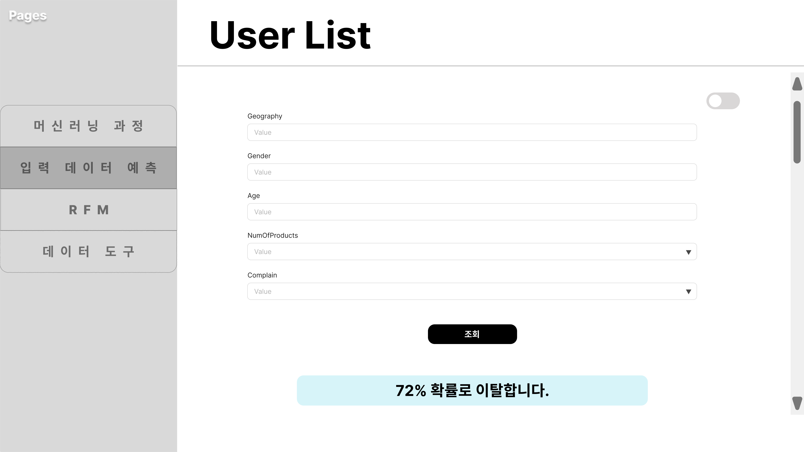
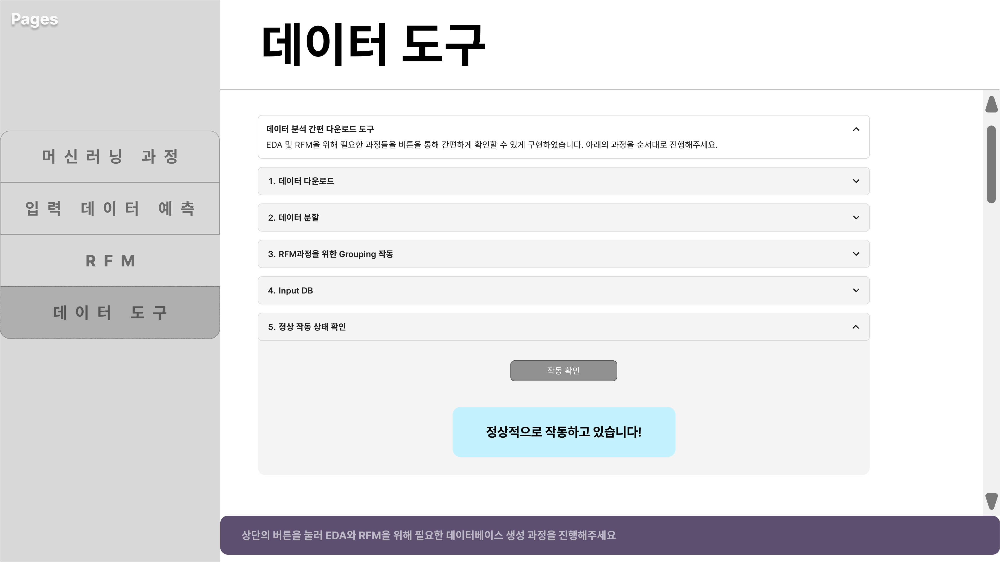

# SKN18-2nd-1Teams
## 은행 고객 이탈율 분석 시스템

---

## Team Information
Team Name : SKN18기 2ND 1조  

| 이름    | 역할   | 세부 역할              | Github     |
|:------: |:-----: |:-------------------: |:----------:|
| 장이건  | 팀장   | 작성예정  | [@poolbbang](https://github.com/poolbbang)  |
| 김준규  | 팀원   | 작성예정  | [@JungyuOO](https://github.com/JungyuOO) |
| 김영우  | 팀원   | 작성예정    | [@youngwookim1006](https://github.com/youngwookim1006) |
| 박세영  | 팀원   | 작성예정  | [@seyung000](https://github.com/seyung000) |
| 황혜진  | 팀원   | 작성예정      | [@HJincode](https://github.com/HJincode) |

---

## 프로젝트 기간
📆2025.09.01 ~ 2025.09.08

---

## 🛠️ Stacks :books:
- **Environment**  
  
  
  

- **Development**  
  
  
  
  

- **Communication**  
  

---

# 프로젝트 개요 
> ## 은행 고객 이탈율 분석
---
최근 금융 산업의 디지털 전환과 경쟁 심화로 인해, **은행 고객 이탈 방지(Customer Retention)**가 중요한 과제로 부상하고 있습니다.

본 프로젝트에서는 은행의 거래 데이터와 고객 정보를 기반으로, 고객의 이탈 여부(Churn)를 사전에 예측하고자 합니다.

이를 위해 고객의 계좌 사용 패턴, 대출 및 카드 이용 내역, 상담 이력 등 다양한 데이터를 분석하고, 이탈 가능성이 높은 고객을 조기에 식별할 수 있는 머신러닝 예측 모델을 개발했습니다.

이 프로젝트는 은행의 맞춤형 금융 상품 제안, 충성 고객 관리, 타겟 마케팅 전략 수립 등에 활용될 수 있는 핵심 인사이트를 제공합니다.

## ✔️ 은행 고객 이탈의 주요 원인

---

## ✅ 1. 은행 고객 이탈의 구조적 요인  

| 원인 | 설명 |
|------|------|
| ❗ 낮은 고객 신용 점수(CreditScore) | 신용 점수가 낮은 고객은 대출·카드 한도가 제한되고, 불리한 조건 때문에 다른 은행으로 이동할 가능성이 높음 |
| ❗ 짧은 거래 기간(Tenure) | 고객 평균 거래 기간이 짧고, 신규 고객(0~1년)의 이탈률이 높음 → 초기 서비스 경험 부족 시 조기 이탈 위험 |
| ❗ 낮은 금융 상품 다양성(NumOfProducts) | 대부분의 고객이 **1~2개 상품만 이용** → 추가 상품으로 확장되지 않으면 장기 충성 고객으로 이어지기 어려움 |
| ❗ 낮은 활동성(IsActiveMember) | **비활성 고객 비율**이 높아 실제 거래가 단절되는 경우가 많음 → 서비스 관계 유지 실패 |
| ❗ 불만 제기(Complain) | 불만을 제기한 고객은 **이탈 확률이 급격히 상승**하며, 고객 클레임 대응 미흡 시 신뢰도 저하로 이어짐 |

---

## ✅ 2. 고객 개인 특성 요인  

| 요인 | 설명 |
|------|------|
| 🔍 연령대 특성(Age) | **젊은 고객층**은 다양한 금융 서비스 실험 후 다른 은행으로 쉽게 이동, **고령층**은 디지털 채널 적응 어려움으로 불편함 경험 |
| 🔍 성별/지역 차이(Gender, Geography) | 특정 지역(Geography) 고객은 경쟁 은행 서비스 선호도가 높고, 성별에 따라 금융 상품 이용 패턴 차이가 발생 |
| 🔍 소득 수준 차이(EstimatedSalary) | 고소득층 고객은 더 나은 조건을 찾아 이탈하고, 저소득층 고객은 수수료·금리에 민감하여 잦은 이탈 발생 |
| 🔍 카드 및 포인트 혜택(Card Type, Point Earned) | 카드 혜택이나 포인트 적립이 부족한 고객은 **경쟁 은행의 리워드 프로그램**으로 이동할 가능성이 높음 |
| 🔍 만족도(Satisfaction Score) | 만족도가 낮은 고객은 장기적으로 이탈 확률이 매우 높으며, 서비스 품질 개선이 이루어지지 않을 경우 충성 고객 전환이 어려움 |

---

##  요구사항
- 은행 고객 이탈 데이터 수집 및 전처리  
- 데이터베이스 설계 및 구축  
- 고객 이탈율 예측 모델 개발 (XGBoost, CatBoost, RandomForest 등)  
- 예측 결과 시각화 및 대시보드 구현  
- 고객 이탈 방지 전략 인사이트 도출  

---

## 데이터셋
- Kaggle Bank Customer Churn Dataset  
- 금융 관련 고객 행동 및 이탈 통계  
- 외부 지표 (경제 지표, 대출/금리 관련 데이터 등)  

---

##  ERD
(ERD 다이어그램 이미지 첨부 예정)

---

## 화면 구성 (Prototype)
### 1. 메인 모델링 화면

---

### 2. 사용자 이탈율 화면 

---

### 3. RFM 화면

---

### 4. 데이터 도구 화면 

---

## 인사이트
1. 고객 특성별 이탈 패턴  
- 나이, 직업, 대출 현황 등에 따른 이탈율 차이  

2. 이탈 주요 요인 파악  
- 신용 점수, 계좌 유형, 지역별 특성이 유의미한 변수  

3. 예측 모델 성능 비교  
- XGBoost, CatBoost, RandomForest 성능 비교 후 최적 모델 선정  

---

##  오류 목록
- GitHub Issues를 통해 관리 예정  

---

## 느낀점 
- 장이건 :  
- 김준규 :  
- 김영우 :  
- 박세영 :  
- 황혜진 :  
