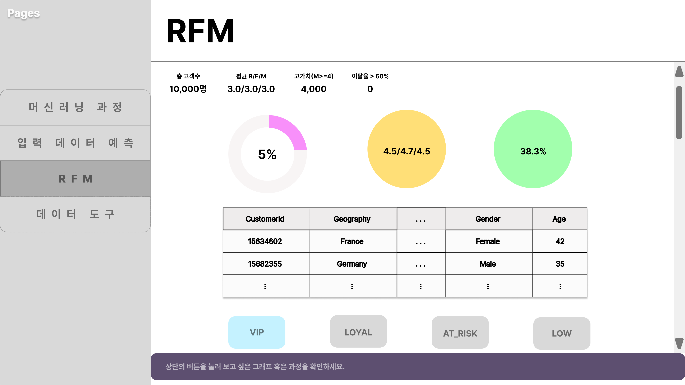

# SKN18-2nd-1Teams
## 은행 고객 이탈율 분석 시스템

---

## Team Information
Team Name : SKN18기 2ND 1조  

| 이름    | 역할   | 세부 역할              | Github     |
|:------: |:-----: |:-------------------: |:----------:|
| 장이건  | 팀장   | 작성예정  | [@poolbbang](https://github.com/poolbbang)  |
| 김준규  | 팀원   | 작성예정  | [@JungyuOO](https://github.com/JungyuOO) |
| 김영우  | 팀원   | 작성예정    | [@youngwookim1006](https://github.com/youngwookim1006) |
| 박세영  | 팀원   | 작성예정  | [@seyung000](https://github.com/seyung000) |
| 황혜진  | 팀원   | 작성예정      | [@HJincode](https://github.com/HJincode) |

---

## 🛠️ Stacks :books:
- **Environment**  
  
  
  

- **Development**  
  
  
  
  

- **Communication**  
  

---

##  요구사항
- 은행 고객 이탈 데이터 수집 및 전처리  
- 데이터베이스 설계 및 구축  
- 고객 이탈율 예측 모델 개발 (XGBoost, CatBoost, RandomForest 등)  
- 예측 결과 시각화 및 대시보드 구현  
- 고객 이탈 방지 전략 인사이트 도출  

---

## 데이터셋
- Kaggle Bank Customer Churn Dataset  
- 금융 관련 고객 행동 및 이탈 통계  
- 외부 지표 (경제 지표, 대출/금리 관련 데이터 등)  

---

##  ERD
(ERD 다이어그램 이미지 첨부 예정)

---

## 화면 구성 (Prototype)
### 1. 메인 모델링 화면

---

### 2. 사용자 이탈율 화면 

---

### 3. RFM 화면

---

### 4. 데이터 도구 화면 

---

## 인사이트
1. 고객 특성별 이탈 패턴  
- 나이, 직업, 대출 현황 등에 따른 이탈율 차이  

2. 이탈 주요 요인 파악  
- 신용 점수, 계좌 유형, 지역별 특성이 유의미한 변수  

3. 예측 모델 성능 비교  
- XGBoost, CatBoost, RandomForest 성능 비교 후 최적 모델 선정  

---

##  오류 목록
- GitHub Issues를 통해 관리 예정  

---

## 느낀점 
- 장이건 :  
- 김준규 :  
- 김영우 :  
- 박세영 :  
- 황혜진 :  
